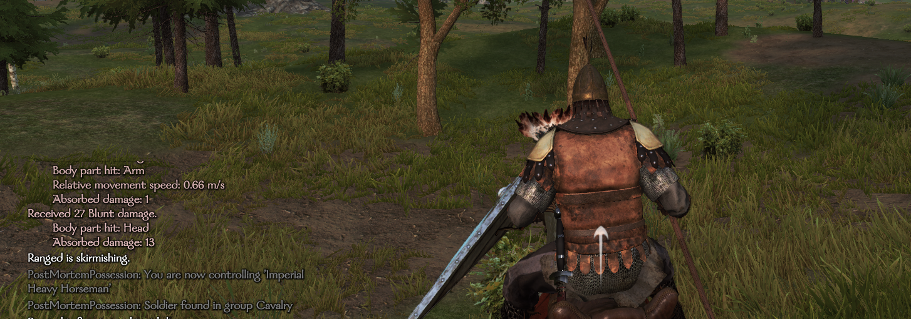
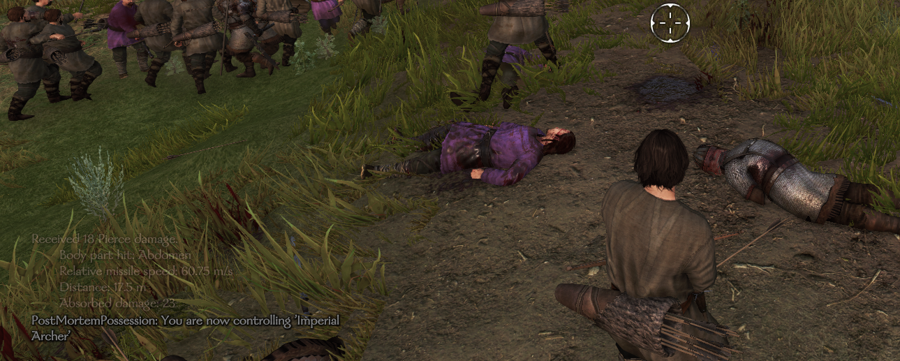

# PostMortemPossession
Mount &amp; Blade II - mod

This Mount &amp; Blade II: Bannerlord mod allows you to take control of friendly soldiers when the player gets knocked out during battle.
This mod was inspired by [Control Your Allies After Death](https://www.nexusmods.com/mountandblade2bannerlord/mods/407) (made by Rafaws). The key difference between these two mods is that this one allows the player to select the friendly unit they wish to control.

The mod has some options that can be configured in a json file.
1. allowControlAllies (bool-default true) : if the player should be able to control ally soldiers
   1. true: Player can control ally and party soldiers
   2. false: Player can only control party soldiers
2. muteExceptions (bool-default true) : if exceptions should be posted to the ingame log
3. verbose (bool-default true) : if various status messages should be posted to the ingame log
4. hotkey (string-default "O") : the key that makes you take control of the soldier the camera is currently following
5. messageColor (list-deafult "[128, 128, 128]"): the color of the status messages
6. errorColor (list-default "[128, 0, 0]"): the color of the error messages
7. autoSelectPriorityHotKey (string-default "U") : the key that makes you take control of the next eligible soldier, based on the priorites you have set in autoSelectPriority
8. autoSelectPriority (list-default "[4, 1, 2, 3, 3, 2, 1, 3, 3]") the priority of the different formations/unit groups. The group with the highest formation will be the one the next soldier will be selected from. The next highest priority will be inspected if none are left in the current group and so on. (ties are allowed and will be determined based on autoSelectRandomWithinPriority)
   1. party companions
   2. infantry
   3. ranged
   4. cavalry
   5. horse archer
   6. skirmisher
   7. heavy infantry
   8. light cavalry
   9. heavy cavalry
   * The default values are set such that the priority is as follows: (companions) > (cavalry, horse archer, light cavalry, heavy cavalry) > (ranged, skirmisher) > (infantry, heavy infantry)
9. autoSelectRandomWithinPriority (bool-default true) : if ties in autoSelectPriority should be resolved at random. False means the group first in the list will be chosenn every time (i.e party companions > infantry > ranged > cavalry > horse archer > skirmisher > heavy infantry > light cavalry > heavy cavalry if we assume that all groups use the same priority)

## How to
How to control/possess a friendly NPC:
1. Get knocked out :p
2. Follow a friendly soldier with the camera
   1. You can do this by getting close to a soldier and then left clicking
3. Hit the key O or U
   * O to select the soldier the camera currently follows
   * U to select the solder that currently has the highest priority

You can repeat this process every time the character is knocked out or killed.

## Installation
You can either compile the project yourself or go to [NEXUS MODS](https://www.nexusmods.com/mountandblade2bannerlord/mods/970) to download the module.
To compile the source youself, follow [this guide](https://docs.bannerlordmodding.com/_tutorials/basic-csharp-mod.html#introduction) and replace SubModule.xml and the MySubModule.cs with files in this repo (xml file with the same name and "PostMortemPossession.cs").
The nuget library Newtonsoft.Json is also used and will have to be installed. The Taleworlds and MountAndBlade references (.dll's) can be found here: ..Mount & Blade II Bannerlord\\bin\\Win64_Shipping_Client

## Limitations
Bandit hideouts are fucked. You won't be able to complete them if you take control of another character.

You can't select the "retreat" option on the scoreboard if you chose to control an NPC, unless you die again.

You won't be able to issue orders to your troops. I have purposfully not tried to implement this as I won't use that feature. You are welcome to create a pull request if you want such a feature (or some other feature) to be included.
